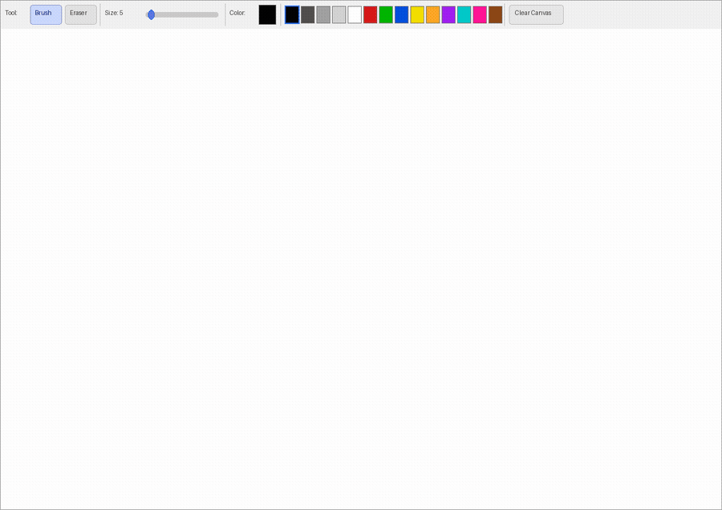

# RustPaint

A simple painting app built with Rust and [egui](https://github.com/emilk/egui) / [eframe](https://github.com/emilk/egui/tree/master/crates/eframe).



## Features

- **Brush** tool — left-click and drag to draw smooth strokes
- **Eraser** tool — erase back to white
- **Color picker** — full RGB/HSV picker via the color button
- **14-color quick palette** — one-click color swatches
- **Brush size** slider (1–50 px)
- **Clear Canvas** button

## Build & Run

```sh
cargo run             # debug build
cargo run --release   # faster rendering
```

Requires a Rust toolchain (1.70+). Dependencies download automatically via Cargo.

## Controls

| Action | How |
|---|---|
| Draw / Erase | Left-click drag on the canvas |
| Pick a precise color | Click the color swatch in the toolbar |
| Quick color | Click any palette swatch |
| Resize brush | Drag the size slider |
| Switch tool | Click **Brush** or **Eraser** |
| Clear | Click **Clear Canvas** |

## Tech

- [`eframe 0.31`](https://crates.io/crates/eframe) — native window and event loop
- [`egui 0.31`](https://crates.io/crates/egui) — immediate-mode GUI + color picker
- Pixel buffer uploaded as a `ColorImage` texture each frame when modified
- Strokes interpolated with Bresenham's line algorithm so fast mouse movement leaves no gaps
